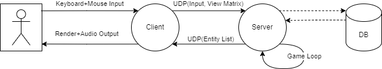
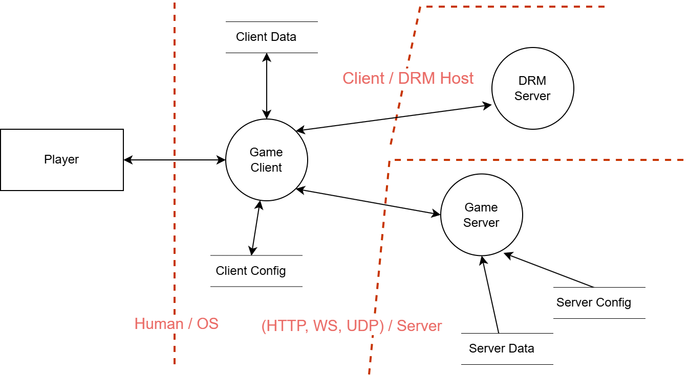
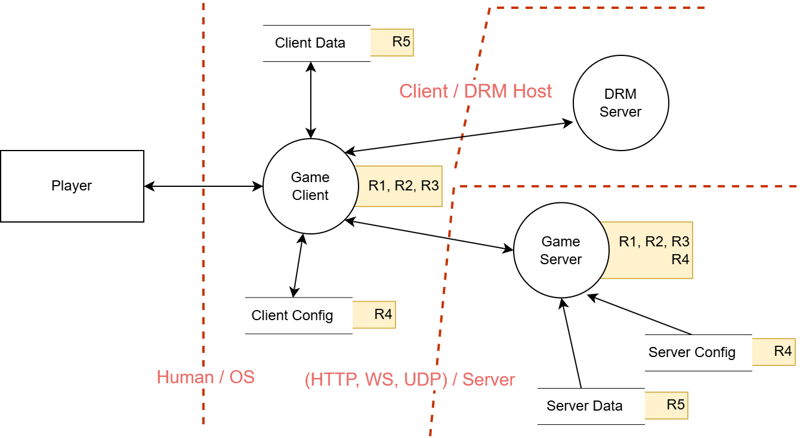

# Модел претњи игара из First Person Shooter жанра

## 1. Упознавање са модулом

### 1.1. Токови података

_Слика 1. Ток рада игре на високом нивоу._

 На слици 1 илустрован је рад онлајн игре на високом нивоу. Сервер игре представља ауторитет саме логике. Он од клијента прима уносе (тастатура, миш или џојстик), као и оријентацију камере; обрађује улазе у погону за игру, и потом свим осталим клијентима шаље ажурирана стања.

_Слика 2. Дијаграм тока података игре._

Пример тока података једне онлајн игре дат је у слици 2. Играч (**Player**) је екстерни ентитет
и крајњи корисник апликације. Функционалности којима он има приступ су:
- глобално рангирање у односу на остале играче
- измена података налога
- претрага и конекција на сервере
- играње игре

Играч учествује у комуникацији преко процесног чвора клијента (**Game Client**). Клијент је десктоп апликација која се обраћа централном серверу (**Central Server**) ради DRM верификације и радом са метаподацима. У току игре, клијент размењује податке са сервером игре (**Game Server**).

Сервер за складиште метаподатака (**Data Server**) чува информације о корисницима (одигране игре, рангови, да ли је корисник блокиран, листе пријатеља између играча и сл.) као и информације о серверима (доступност, број играча, географска локација).

Сервер за DRM (**DRM Server**) обезбеђује заштиту од пиратерије. Реализован је као _always online DRM_ који захтева сталну конекцију са клијентима. Клијенти периоднично шаљу потребне податке о свом идентитету које сервер за DRM валидира.

### 1.2. Ресурси и претње

На слици 3 приказан је дијаграм токова података, допуњен са одабраним ресурсима од значаја.
У табели 1 је дат опис за сваки од ресурса. Коначно, у табели 2 су идентификоване потенцијалне претње на те ресурсе. Напомињемо да, иако се неки ресурси налазе уз више чворова дијаграма, то не значи да су ти чворови подједнако подложни нападима на рањивости тих ресурса.

_Слика 3. Модификован дијаграм тока података игре, где су одређеним чворовима придружени значајни ресурси. Ресурси су репрезентовани идентификатором који одговара првој колони у табели 1._

| ID | Ресурс |
| -- | ------ |
| R1 | Позиције играча |
| R2 | Статус играча (енергија, муниција, оружје) |
| R3 | Привилегије играча |
| R4 | Конфигурационе варијабле |
| R5 | Кориснички профили |
| R6 | Подаци о серверима |
| R7 | Асети игре |

_Табела 1. Одабрани ресурси._

| ID | Рањив ресурс | Претња | Тип (STRIDE) |
| -- | -------- | ------ | --- |
| T1 | R1 | Приступ позицијама играча који нису видљиви | Information Disclosure |
| T2 | R2 | Измена података о играчима | Tampering |
| T3 | R3 | Бановање других играча | Spoofing, Elevation of privilege |
| T4 | R4 | Рушење апликације | Denial of Service |
| T5 | R5 | Измена ранга играча | Tampering |
| T6 | R6 | Уклањање доступности сервера | Tampering, Denial of Service |
| T7 | R7 | Приказ играча који нису видљиви | Information Disclosure, Tampering |
| T8 | R7 | Нарушавање угледа игре | Tampering |

_Табела 2. Одабране претње._

## 2. Идентификација напада

## 3. Анализа напада и митигације