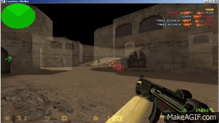

# Модел претњи игара из First Person Shooter жанра

## 1. Упознавање са модулом

Анализирани модул представља игру First Person Shooter (FPS) жанра, налик играма _Quake_ и _Counter-Strike_. На слици 1 налази се поједностављена шема овог модула.

### 1.1. Токови података


_Слика 1. Ток рада игре на високом нивоу._

Модул се састоји из две компоненте:
- На **серверу** је покренута сама игра.
- **Клијент** функционише као удаљен улазно-излазни уређај. 

Клијенти примају унос са тастатуре и миша и шаљу га серверу. На основу тих уноса, сервер обрађује стања свих играча којима одговарају конектовани клијенти. Сервер потом шаље измене стања игре сваком од клијената који су на њега повезани. На основу новог стања игре, клијенти ажурирају своје локално стање које потом рендерују на екран. Овај поступак се понавља више пута у секунди како би корисник добио утисак кретања.


_Слика 2. Дијаграм тока података игре._

Пример тока података једне дат је на слици 2. Играч (**Player**) је екстерни ентитет
и крајњи корисник апликације. Функционалности којима он има приступ су:
- глобално рангирање у односу на остале играче
- измена података налога
- претрага и конекција на сервере
- играње игре


Играч учествује у комуникацији преко процесног чвора клијента (**Game Client**). Конфигурације клијента (попут резолуције екрана, контрола, јачина звука итд.) се складиште на фајл систему (**Client Config**). Приказ графичког и аудио садржаја се обавља са клијентске стране, стога клијент мора да чува асете локално (**Client Data**).

По својој природи, клијент је "глуп" - он нема сложену интерну логику, већ ће обраћа серверу (**Game Server**) на који је конектован. На серверу је покренута игра: ту се обрађује логика игре и физика. При покретању, сервер учитава конфигурације из датотеке (**Server Config**). Сервер може по потреби да служи додатан садржај у виду специјалних асета које клијенти преузимају током конекције на сервер. Ти асети се чувају локално (**Server Data**).

Сервер за DRM (**DRM Server**) обезбеђује заштиту од пиратерије. Реализован је као _always online DRM_ који захтева сталну конекцију са клијентима. Клијенти периоднично шаљу потребне податке о свом идентитету које сервер за DRM валидира.

### 1.2. Ресурси и претње

На слици 3 приказан је дијаграм токова података, допуњен са одабраним ресурсима од значаја.


_Слика 3. Модификован дијаграм тока података игре, где су одређеним чворовима придружени значајни ресурси. Ресурси су репрезентовани идентификатором који одговара првој колони у табели 1._

У табели 1 је дат опис за сваки од ресурса, а у табели 2 су идентификоване потенцијалне претње на те ресурсе. Иако се неки ресурси налазе уз више чворова дијаграма, напомињемо да то не значи да су ти чворови подједнако подложни нападима на рањивости тих ресурса.


| ID | Ресурс |
| -- | ------ |
| R1 | Позиције играча |
| R2 | Статус играча (енергија, муниција, оружје) |
| R3 | Привилегије играча |
| R4 | Конфигурационе варијабле |
| R5 | Асети игре |

_Табела 1. Одабрани ресурси._

| ID | Рањив ресурс | Претња | Тип (STRIDE) |
| -- | -------- | ------ | --- |
| T1 | R1 | Манипулација положајем играча | Information Disclosure |
| T2 | R2 | Измена података о играчима | Tampering |
| T3 | R3 | Бановање других играча | Spoofing, Elevation of privilege |
| T4 | R4 | Рушење апликације | Denial of Service |
| T5 | R5 | Уклањање доступности сервера | Tampering, Denial of Service |
| T6 | R5 | Приказ играча који нису видљиви | Information Disclosure, Tampering |
| T7 | R5 | Нарушавање угледа игре | Tampering |

_Табела 2. Одабране претње. Колона тип одређује безбедносно својство ресурса које претња покушава да наруши._

**Нападач** у FPS играма је најчешће обичан играч. Овај рад искључиво разматра нападе од стране играча. Издвојене су следеће мотивације нападача:
- бржи и лакши пут до напретка користећи пречице, без улагања труда као остали играчи
- освета другим играчима из претходних партија игара
- намерно изазивање играча ради њихове реакције (_trolling_)

## 2. Идентификација претњи и напада

У овом раду разматрана је претња T1. Разрађено стабло напада дато је на слици 4. 


_Слика 4. Стабло напада за претњу T1._

У наставку је дат кратак преглед свих претњи и напада са слике 4, од којих ће неки бити дубље анализирани у секцији 3.

Манипулација положајем играча подразумева неовлашћено читање и писање података о играчима у текућој игри. У играма FPS жанра, најпознатија злоупотреба ове претње је у виду ботова за нишан (_aimbot_) где се нишан играча аутоматски позиционира ка непријатељу на основу његове позиције. У овом раду _aimbot_ напади су груписани као напади на **_aimbot_ претња - T1.1**. У табели 3 дат је преглед напада за ову претњу.

| ID | Опис |
| -- | ---- |
| A1.1.1 | Инјектује се код у игру (нпр. кроз DLL) који израчунава нову _View_ матрицу играча на основу видљивих непријатеља. |
| A1.1.2 | Модификација напада A1.1.1 која узима у обзир приказану графику на екрану и техникама рачунарске визије издваја непријатеље. |
| A1.1.3 | Конзолне игре FPS жанра аутоматски нишане играча на непријатеља ако играч гледа у непријатеља уз одређен праг. Модификацијом прага би игра увек нишанила играча. |
| A1.1.4 | Слично нападу A1.1.2, али се нишан ради физички - управљањем серво мотором који покреће миш. |

_Табела 3. Напади на претњу T1.1._

**ESP (_Extra Sensory Perception_) - T1.2** фамилија напада играчу приказује додатне информације о противницима - положај, енергија, муниција, ранг и сл. У случају T1 претње, фокус је само на положају играча. За разлику од _aimbot_ претње, ESP рањвост подразумева само неовлашћено читање података. Табела 4 описује издвојене нападе за ову претњу.

| ID | Опис |
| -- | ---- |
| A1.1.2 | Сви играчи у мапи се рендерују, без обзира на то да ли су заклоњени зидовима. |
| A1.2.2 | Асети игре се мењају тако да сви играчи буду видљиви (нпр. текстуре зидова постају невидљиве). |

_Табела 4. Напади на претњу T1.2._

**T1.3 напади** подразумевају модификацију позиције играча са клијентске стране. Издвојени напади на ову претњу дати су у табели 5.

| ID | Опис |
| -- | ---- |
| A1.3.1 | Нападач поставља произвољну вредност за позицију себе или противника. |
| A1.3.2 | Нападач модификује брзину играча и тако брже стиже до неке локације. |

_Табела 5. Напади на претњу T1.3._

## 3. Анализа напада и митигације

### A1.1.3 Aim Assist Enhancer

#### Анализа напада

Неке игре аутоматски померају играчев нишан ка непријатељу ако играч посматра непријатеља унутар неког прага. Ова функционалност се зове _aim assist_ и саставни је део многих конзолних игара.

Праг за _aim assist_ је конфигурабилна вредност: играчи је постављају на вредност која њима оговара. У зависности од игре, могуће је и да сервер контролише ову вредност за све клијенте.

Овај напад подразумева измену прага тако да се _aim assist_ активира чак и ако играч не гледа ни приближно у правцу непријатеља. Играч у конфигурацијама игре може да промени ову вредност прага, у виду слајдера.

Слајдер, као елемент графичког корисничког интерфејса, сам по себи ограничава вредност прага на неки минимум и максимум. Рањивост потиче из чињенице да се вредност прага контролише искључиво кроз GUI елемент. Напад би се онда спровео директном променом вредности прага у радној меморији, користећи алате попут _CheatEngine_ или _CodeBreaker_. Алтернативни напад би подразумевао да се у трајном складишту модификује вредност прага који потом клијент учитава при покретању.

#### Анализа рањивости

Претпоставимо да следећи исечак кода одговара клијентској апликацији:

```c++
bool shouldActivateAimAssist(Mat4x4 viewMatrix, Entity* self, Entity* player)
{
    if (self->team != player->team)
    {
        return false;
    }

    if (!self->isAlive() || !player->isAlive())
    {
        return false;
    }

    const float minDistance = 20;

    Vec3 lookForward = self->getForward(viewMatrix);
    Vec3 lookPoint = self->pos + lookForward * minDistance;
    Vec3 deltaPos = player->pos - self->pos;

    if (lookForward.dot(deltaPos) > 0)
    {
        return false;
    }

    float threshold = global::Client.cvars["CV_ASSITHRESH"];

    if ((lookPoint - deltaPos).length() < threshold)
    {
        return true;
    }

    return false;
}
```

Рањивост се налази на следећој линији кода:

```c++
float threshold = global::Client.cvars["CV_ASSITHRESH"];
```

Клијентска апликација не валидира вредност прага, већ наивно верује садржају из меморије  или са диска.

#### Безбедносне контроле

Довољно је урадити проверу вредности при учитавању и њено свођење на дозвољени праг. Провера се додаје одмах после читања, чиме се гарантује да ће праг имати валидну вредност пре употребе.

```c++
bool shouldActivateAimAssist(Mat4x4 viewMatrix, Entity* self, Entity* player)
{
    // ...

    float threshold = global::Client.cvars["CV_ASSITHRESH"];

    // +++++++++++++++++++++++++++++++++++++++++++++++++
    if (threshold < CV_ASSITHRESH_MIN) {
        threshold = CV_ASSITHRESH_MIN;
        client_set_cvar("CV_ASSITHRESH", threshold);
    }
    else if (threshold > CV_ASSITHRESH_MAX) {
        threshold = CV_ASSITHRESH_MAX;
        client_set_cvar("CV_ASSITHRESH", threshold);
    }
    // _________________________________________________

    // ...
}

```

### A1.1.1 Client Hook Aimbot

Хук (_hook_) је механизам за проширење програма.
У Windows оперативним системима, хукови се могу реализовати преко DLL инјекција:
процес учитава _dll_ код унутар другог процеса.

Овај напад подразумева DLL инјекцију којом се пресрећу процедуре у клијентској апликацији чији је задатак да
добаве податке о играчима са сервера.

На слици 5 приказан је пример овог напада.



_Слика 5. Hook aimbot за игру Counter-Strike 1.6._

#### Анализа напада

У наставку су описана два корака овог напада: инјекција и злоупотреба података.

##### 1. Инјекција

Инјекцију извршава помоћни програм за учитавање DLL датотеке - _DLL loader_.
У следећем исечку кода приказани су кључни делови једног таквог програма за Windows:

```c++
// (1)
HANDLE hProcess = OpenProcess(...)

LPVOID loadFunctionAddress = GetProcAddress(
    GetModuleHandle("kernel32.dll"), 
    "LoadLibraryA"
);

// (2)
LPVOID allocatedMem = VirtualAllocEx(
    procHandle, 
    nullptr, 
    MAX_PATH, 
    MEM_RESERVE | MEM_COMMIT, PAGE_READWRITE
);

WriteProcessMemory(
    procHandle, 
    allocatedMem, 
    dllPath, 
    MAX_PATH, 
    nullptr
);

// (3)
HANDLE threadHandle = CreateRemoteThread(
    procHandle, 
    nullptr, 
    NULL, 
    LPTHREAD_START_ROUTINE(loadFunctionAddress), 
    allocatedMem, 
    NULL, 
    nullptr
);
```

Конкретно, програм има три битна корака:

1) Добавља се клијентска апликација `hProcesss` и учитава системска функција `LoadLibraryA`.
2) У виртуелну меморију клијентског процеса се уписује путања до малициозног DLL-а.
3) Клијентски процес покреће нит у којој се учитава малициозни DLL.

##### 2. Злоупотреба података

У наставку је описан поступак са [следећег чланка](https://bananamafia.dev/post/multihack/).
Мета напада је игра `idTech3` погона за игре, који је првобитно направљен за `Quake III Arena` игру FPS жанра.

Комуникација између клијента и сервера у `idTech3` погону се обавља кроз системске позиве.
Ово се разликује од стандардних системских позива у оперативним системима.

Сервер шаље команде клијенту у виду системских позива.
Клијент, по примању појединачних системских позива, покреће 
функцију `syscall` која прима тип команде и до 14 аргумената.
Један тип команди је `CG_GETDEFAULTSTATE`, којим се синхронизују 
подаци о ентитетима у току игре.

Преретањем `syscall` функције, било би могуће добавити положај ентитета
и тако имплементирати _aimbot_. Исечак кода испод приказује поједностављен
_aimbot_ који ради по овом принципу. На слици 6 илустрован је ток напада.

```c++
int syscall_hook(int cmd, ...)
{
    // (1)
    int arg[14] = ...

    switch (cmd)
    {
        // (2)
        case CG_GETDEFAULTSTATE:
            {
                // (3)
                centity_t* entity = (centity_t*)arg[1];
                // (4)
                aim(entity);
            }
            break;
        default:
            break;
    }

    // (5)
    return syscall(cmd, arg[0], arg[1], ..., arg[13]);
}

void aim(centity_t* entity)
{
    v3_t point = world_to_space(ent->currentState.pos, ...);
    INPUT Input = ...
    SendInput(1, &Input, sizeof(INPUT));
}
```


_Слика 6. Дијаграм секвенце aimbot напада преко DLL инјекције._

#### Анализа рањивости

За разлику од многих напада на видео игре, као и напада на софтвер уопште, овде рањивост није последица лоше валидације података, багова у коду или недостатка у екстерној библиотеци.
Постоје два велика разлога зашто је овај напад могућ, при чему је присуство сваког од њих у некој мери оправдано.

Први разлог је сама **DLL инјекција** - оперативни системи користе DLL инјекцију да би подржали _hot patching_ (измену кода у процесу док је тај процес покренут) [[1]](https://signal-labs.com/windows-hotpatching-amp-process-injection/) [[2]](https://www.codeproject.com/Articles/116253/Hot-Patching-Made-Easy). Логовање акција се може радити на нивоу кернела помоћу ове технике. Измена  _legacy_ система чији изворни код није доступан је могуће преко DLL инјекције. У неким играма је ово уједно и једини начин да се имплементирају модификације (_mods_).

Други разлог је природа **клијент-сервер архитектуре**. Развој игара је нестандардан процес. Многе FPS игре се заснивају на постојећим погонима, најчешће оним који је развио _id Software_ [[3]](https://upload.wikimedia.org/wikipedia/commons/6/63/Quake_-_family_tree.svg). Додатно, _QuakeWorld_ је увео иновације које су омогућиле онлајн игру  изван LAN мреже са пристојним перформансама [[4]](https://fabiensanglard.net/quakeSource/quakeSourceNetWork.php). У то време су највећи изазови били кашњење (latency) и ограничен пропусни опсег. Онлајн игре су фундаментално другачије од стандардних веб апликација: само одређен подскуп нефункционалних захтева (нпр. безбедност) је могуће испунити док то не крене да нарушава перформансе.

#### Безбедносне контроле

Најефективнији начин контроле овог напада је **провера интегритета клијента**: меморија процеса се проверава за било какве модификације [[5]](https://www.ijcaonline.org/archives/volume185/number33/martinson-2023-ijca-923110.pdf). Међутим, овај приступ ефективно неомогућава играчима да модификују игру у добронамерне сврхе, у виду плагина и модова.

Алтернативни приступ су **драјвери на нивоу кернела** (_kernel-level driver_) попут _RICOCHET_ [[6]](https://support.activision.com/articles/ricochet-overview), _Battleye_ [[7]](https://www.battleye.com/) и _Vanguard_ [[8]](https://support-valorant.riotgames.com/hc/en-us/articles/360046160933-What-is-Vanguard). Ови програми се покрећу на нивоу привилегија кернела (дакле, као системски софтвер) што им омогућава приступ и мониторинг других процеса. Главни недостатак овом виду контроле јесте што би ови драјвери могли нанети велику штету уколико би у њих развојни тим уградио процесе за шпијунирање и неовлашћено прикупљање података [[9]](https://www.osnews.com/story/131665/riot-games-maker-of-league-of-legends-installs-rootkit-with-their-new-hit-game-valorant/).

Још једна алтернатива је такозвани **_spinbot_**.
То је програм или скрипта која, у најосновнијем случају, аутоматски окреће клијента око своје осе
тако да се његов рањив оквир (_hitbox_) мења у сваком такту игре.
_Spinbot_ је једна од техника _antiaim_ фамилије.
Он се за ову сврху може користити само у неким играма.
Додатно, савремене _aimbot_ технике попут _silent aim_ могу да превазиђу _spinbot_.
Коначно, _Spinbot_ се и сам може користити као механизам за варање.


# Литература

[1] https://signal-labs.com/windows-hotpatching-amp-process-injection/ Датум приступа: 12.12.2024.

[2] https://www.codeproject.com/Articles/116253/Hot-Patching-Made-Easy Датуп приступа: 12.12.2024.

[3] https://upload.wikimedia.org/wikipedia/commons/6/63/Quake_-_family_tree.svg Датум приступа: 12.12.2024.

[4] https://fabiensanglard.net/quakeSource/quakeSourceNetWork.php Датум приступа: 12.12.2024.

[5] https://www.ijcaonline.org/archives/volume185/number33/martinson-2023-ijca-923110.pdf Датум приступа: 12.12.2024.

[6] https://support.activision.com/articles/ricochet-overview Датум приступа: 12.12.2024.

[7] https://www.battleye.com/ Датум приступа 12.12.2024.

[8] https://support-valorant.riotgames.com/hc/en-us/articles/360046160933-What-is-Vanguard Датум приступа 12.12.2024.

[9] https://www.osnews.com/story/131665/riot-games-maker-of-league-of-legends-installs-rootkit-with-their-new-hit-game-valorant/ Датум приступа 12.12.2024.