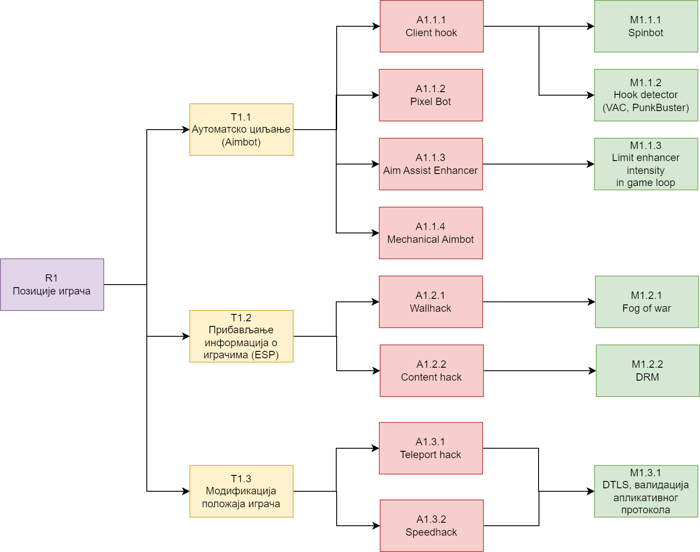

# Модел претњи игара из First Person Shooter жанра

## 1. Упознавање са модулом

Анализирани модул представља игру First Person Shooter (FPS) жанра, налик играма _Quake_ и _Counter-Strike_. На слици 1 налази се поједностављена шема овог модула.

### 1.1. Токови података

_Слика 1. Ток рада игре на високом нивоу._

Модул се састоји из две компоненте:
- На **серверу** је покренута сама игра.
- **Клијент** функционише као удаљен улазно-излазни уређај. 

Клијенти примају унос са тастатуре и миша и шаљу га серверу. На основу тих уноса, сервер обрађује стања свих играча којима одговарају конектовани клијенти. Сервер потом шаље измене стања игре сваком од клијената који су на њега повезани. На основу новог стања игре, клијенти ажурирају своје локално стање које потом рендерују на екран. Овај поступак се понавља више пута у секунди како би корисник добио утисак кретања.

_Слика 2. Дијаграм тока података игре._

Пример тока података једне дат је на слици 2. Играч (**Player**) је екстерни ентитет
и крајњи корисник апликације. Функционалности којима он има приступ су:
- глобално рангирање у односу на остале играче
- измена података налога
- претрага и конекција на сервере
- играње игре

Играч учествује у комуникацији преко процесног чвора клијента (**Game Client**). Конфигурације клијента (попут резолуције екрана, контрола, јачина звука итд.) се складиште на фајл систему (**Client Config**). Приказ графичког и аудио садржаја се обавља са клијентске стране, стога клијент мора да чува асете локално (**Client Data**).

По својој природи, клијент је "глуп" - он нема сложену интерну логику, већ ће обраћа серверу (**Game Server**) на који је конектован. На серверу је покренута игра: ту се обрађује логика игре и физика. При покретању, сервер учитава конфигурације из датотеке (**Server Config**). Сервер може по потреби да служи додатан садржај у виду специјалних асета које клијенти преузимају током конекције на сервер. Ти асети се чувају локално (**Server Data**).

Сервер за DRM (**DRM Server**) обезбеђује заштиту од пиратерије. Реализован је као _always online DRM_ који захтева сталну конекцију са клијентима. Клијенти периоднично шаљу потребне податке о свом идентитету које сервер за DRM валидира.

### 1.2. Ресурси и претње

На слици 3 приказан је дијаграм токова података, допуњен са одабраним ресурсима од значаја.

_Слика 3. Модификован дијаграм тока података игре, где су одређеним чворовима придружени значајни ресурси. Ресурси су репрезентовани идентификатором који одговара првој колони у табели 1._

У табели 1 је дат опис за сваки од ресурса, а у табели 2 су идентификоване потенцијалне претње на те ресурсе. Иако се неки ресурси налазе уз више чворова дијаграма, напомињемо да то не значи да су ти чворови подједнако подложни нападима на рањивости тих ресурса.

| ID | Ресурс |
| -- | ------ |
| R1 | Позиције играча |
| R2 | Статус играча (енергија, муниција, оружје) |
| R3 | Привилегије играча |
| R4 | Конфигурационе варијабле |
| R5 | Асети игре |

_Табела 1. Одабрани ресурси._

| ID | Рањив ресурс | Претња | Тип (STRIDE) |
| -- | -------- | ------ | --- |
| T1 | R1 | Манипулација положајем играча | Information Disclosure |
| T2 | R2 | Измена података о играчима | Tampering |
| T3 | R3 | Бановање других играча | Spoofing, Elevation of privilege |
| T4 | R4 | Рушење апликације | Denial of Service |
| T5 | R5 | Уклањање доступности сервера | Tampering, Denial of Service |
| T6 | R5 | Приказ играча који нису видљиви | Information Disclosure, Tampering |
| T7 | R5 | Нарушавање угледа игре | Tampering |

_Табела 2. Одабране претње. Колона тип одређује безбедносно својство ресурса које претња покушава да наруши._

**Нападач** у FPS играма је најчешће обичан играч. Овај рад искључиво разматра нападе од стране играча. Издвојене су следеће мотивације нападача:
- бржи и лакши пут до напретка користећи пречице, без улагања труда као остали играчи
- освета другим играчима из претходних партија игара
- намерно изазивање играча ради њихове реакције (_trolling_)

## 2. Идентификација претњи и напада

У овом раду разматрана је претња T1. Разрађено стабло напада дато је на слици 4. 

_Слика 4. Стабло напада за претњу T1._

У наставку је дат кратак преглед свих претњи и напада са слике 4, од којих ће неки бити дубље анализирани у секцији 3.

Манипулација положајем играча подразумева неовлашћено читање и писање података о играчима у текућој игри. У играма FPS жанра, најпознатија злоупотреба ове претње је у виду ботова за нишан (_aimbot_) где се нишан играча аутоматски позиционира ка непријатељу на основу његове позиције. У овом раду _aimbot_ напади су груписани као напади на **_aimbot_ претња - T1.1**. У табели 3 дат је преглед напада за ову претњу.

| ID | Опис |
| -- | ---- |
| A1.1.1 | Инјектује се код у игру (нпр. кроз DLL) који израчунава нову _View_ матрицу играча на основу видљивих непријатеља. |
| A1.1.2 | Модификација напада A1.1.1 која узима у обзир приказану графику на екрану и техникама рачунарске визије издваја непријатеље. |
| A1.1.3 | Конзолне игре FPS жанра аутоматски нишане играча на непријатеља ако играч гледа у непријатеља уз одређен праг. Модификацијом прага би игра увек нишанила играча. |
| A1.1.4 | Слично нападу A1.1.2, али се нишан ради физички - управљањем серво мотором који покреће миш. |

_Табела 3. Напади на претњу T1.1._

**ESP (_Extra Sensory Perception_) - T1.2** фамилија напада играчу приказује додатне информације о противницима - положај, енергија, муниција, ранг и сл. У случају T1 претње, фокус је само на положају играча. За разлику од _aimbot_ претње, ESP рањвост подразумева само неовлашћено читање података. Табела 4 описује издвојене нападе за ову претњу.

| ID | Опис |
| -- | ---- |
| A1.1.2 | Сви играчи у мапи се рендерују, без обзира на то да ли су заклоњени зидовима. |
| A1.2.2 | Асети игре се мењају тако да сви играчи буду видљиви (нпр. текстуре зидова постају невидљиве). |

_Табела 4. Напади на претњу T1.2._

**T1.3 напади** подразумевају модификацију позиције играча са клијентске стране. Издвојени напади на ову претњу дати су у табели 5.

| ID | Опис |
| -- | ---- |
| A1.3.1 | Нападач поставља произвољну вредност за позицију себе или противника. |
| A1.3.2 | Нападач модификује брзину играча и тако брже стиже до неке локације. |

_Табела 5. Напади на претњу T1.3._

## 3. Анализа напада и митигације