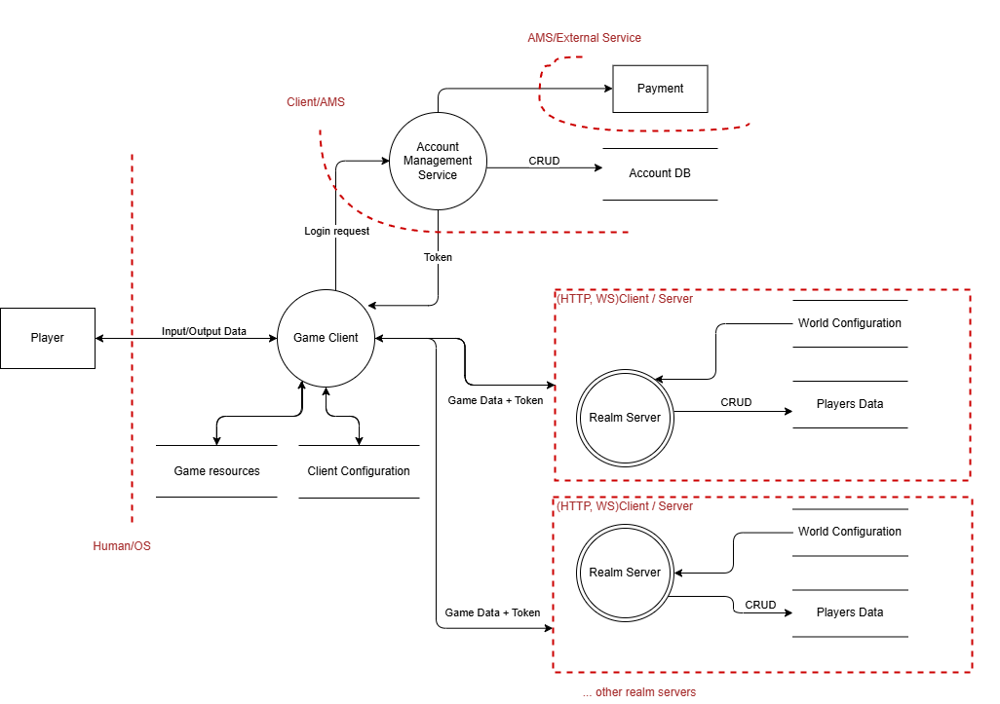
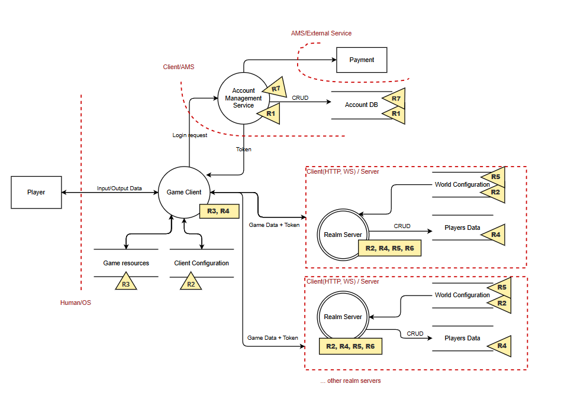
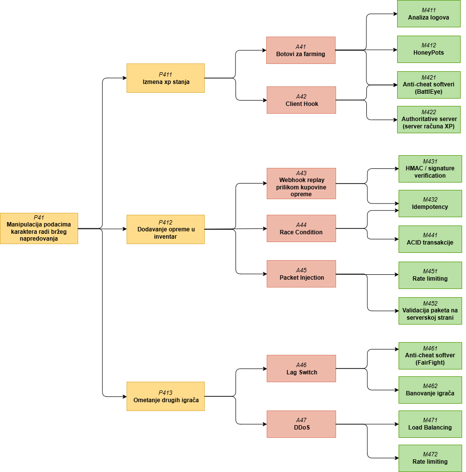
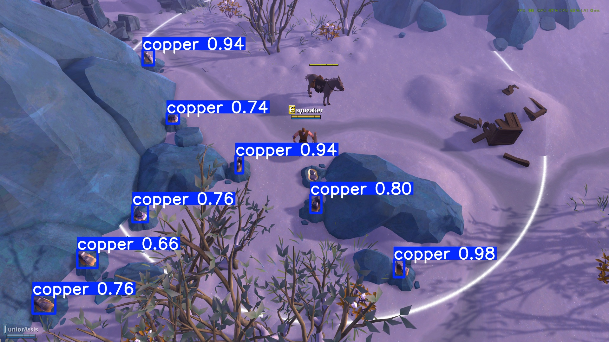

# Model pretnji igrica MMORPG žanra

## 1. Upoznavanje i dekompozicija modula

Analizirani modul predstavlja igricu _Massively multiplayer online role-playing game_ (MMORPG) žanra (igrice kao što su _WOW_, _LOTRO_, _Albion online_ i slične).

### 1.1. Tokovi podataka analiziranog modula


Funkcionalnosti koje igrač ima:
- Login ili registracija profila
- Odabir karaktera (izbor klase, rase, pola, imena i prilagođavanje vizuelnog izgleda lika)
- Odabir servera (napredak karaktera je specifičan za izabrani server)
- Gameplay igre (misije, borba sa neprijateljima (PvE), borba sa drugim igračima (PvP), rangiranje igrača, in-game trgovina, upravljanje guild-ovima i grupama, 
komunikacija sa drugim igračima kroz četove, napredovanje kroz XP sistem i nivoe, učešće u sezonskim događajima)
- Pretplate ili kupovina određenog sadržaja igre

Slika ispod prikazuje tok podataka analiziranog modula.

 
*Slika 1. Dijagram toka podataka igrice MMORPG žanra*

---

**Igrač (Player)** je eksterni entitet koji komunicira sa klijentom. Igrač šalje ulazne komande/zahtjeve koristeći klijenta. 

**Klijent** je komponenta koju igrači koriste za povezivanje sa serverom i interakciju sa igrom. Klijent se pokreće lokalno (na računaru/mobilnom telefonu/konzoli) i predstavlja osnovni interfejs između igrača i servera. Glavna uloga je da prikuplja korisničke komande i da ih šalje serveru na obradu. Kao odgovor od servera klijent dobija ažurirano stanje igre i vrši prikazivanje tog virtuelnog svijeta igraču.
Klijent komunicira sa dva skladišta podataka: **Client Configuration** i **Game Resources**.

**Client Configuration**: skladište podataka koje čuva podešavanje korisničkog okruženja poput rezolucije, glasnoće zvuka, nivoa detalja i ostalih opcija za podešavanje klijenta.

**Game Resources**: skladište podataka koje čuva asete u okviru igre (mape, teksture, audio sadržaj i drugo).

---

**Account Managment Service (AMS)** je komponenta koja je zadužena za upravljanje nalozima i autentifikaciju. Povezana je sa eksternim entitetom za izvršenje transakcija (**Payment**). Komunicira sa skladištem **Account DB**.

**Account DB**: skladište podataka koje čuva podatke o korisničkim profilima i privilegijama.

---

**Realm Serveri** su komponente koje upravljaju logikom igre, ažuriraju stanje i ažurirano stanje šalju nazad klijentima na prikaz. Svaki server obično pripada određenom geografskog regionu (EU, NA, Asia i slično). Svaki server komunicira sa svoja dva skladišta podataka: **World Configuration** i **Players Data**.

**World Configuration**: skladište podataka koje skladišti podatke o resursima u svijetu, aktivnim događajima servera, ekonomiji servera.

**Players Data**: skladište podataka koje sadrži podatke o svakom karakteru servera: inventar, nivo, status misija, pozicija u svijetu, spisak prijatelja i slično.

---

### 1.2. Resursi i prijetnje

Tabela ispod identifikuje resurse i pruža kratak opis za svaki resurs, a na slici ispod tabele je prikazan tok podataka dopunjen identifikovanim resursima.

| Oznaka | Resurs                     | Opis                                                                 
|--------|----------------------------|----------------------------------------------------------------------|
| R1     | Korisnički nalozi          | Profili vezani za AMS.       |
| R2     | Konfiguracija     | Postavke za klijenta i za servere. | 
| R3     | Aseti     | Resursi vezani za klijenta.                | 
| R4     | Podaci o karakterima       | Podaci igrača vezani za jedan server.              | 
| R5     | Resursi svijeta              | Stanje svijeta nekog servera.                | 
| R6    | Logovi i telemetrija       | Evidencija akcija igrača.             | 
| R7     | Sistem plaćanja   | Transakcije i povezani payment nalozi.                       | 

*Tabela 1. Identifikovani resursi*




*Slika 2. Dijagram toka podataka sa prikazom identifikovanih resursa*

Tabela u nastavku navodi pretnje za identifikovane resurse, kao i bezbjednosno svojstvo koje se narušava pretnjom.


| **Resurs**              | **Pretnja**                                          | **STRIDE tip**            |  
|--------------------------|-----------------------------------------------------|---------------------------|  
| R1. Korisnički nalozi    | P11. Phishing i krađa kredencijala                                  |  Spoofing, Information Disclosure |  
|         | P12. Aktiviranje pretplate                               | Elevation of Privilege, Tampering |  
|      | P13. Narušavanje reputacije                                  | Spoofing                  |  
| R2. Konfiguracija            | P21. Rušenje aplikacije                                  | Denial of Service         | 
| R3. Aseti           | P31. Prikaz skrivenih stvari sa mape                    | Information Disclosure    |  
| R4. Podaci o karakterima         | P41. Manipulacija podacima radi bržeg napredovanja             | Tampering, Elevation of Privilege                 |  
|             | P42. Dobavljanje privatnih četova radi rušenja reputacije| Information Disclosure    |   
| R5. Resursi svijeta       | P51. Kreiranje beskonačne zalihe određenih resursa       | Tampering                 |   
| R6. Logovi i telemtrija         | P61. Brisanje logova da se prikriju tragovi napada            | Repudiation, Tampering    | 
|   | P62. Prisluškivanje logova radi narušavanja reputacije    |  Information Disclosure    |   
| R7. Sistem plaćanja           | P71. Dupliranje transkacija            | Repudiation, Tampering    |  

*Tabela 2. Prikaz potencijalnih pretnji visokog nivoa za identifikovane resurse*

Glavna motivacija napadača i varanja u MMORPG žanru:
- Takmičarska prednost: želja igrača da dominiraju nad drugima i budu percipirani kao vješti ili moćni unutar zajednice igre.
- Ekonomska dobit: igrači varaju da bi stekli rijetke predmete ili valutu koje mogu prodati za profit.
- Ušteda vremena: da zaobiđu ponavljajuće ili vremenski zahtjevne zadatke.

## 2. Identifikacija pretnji i napada

U nastavku analizirana je pretnja P41. - Manipulacija podacima radi bržeg napredovanja. Slika ispod daje prikaz pretnji niskog nivoa, napada i odbrambenih menanizama za odabranu pretnju.



*Slika 3. Stablo napada za pretnju P41*   

U nastavku biće kratko opisani svaki od napada iz prethodnog stabla, kao i njihove navedene mitigacije. Detaljniji opisi nekih napada biće predstavljeni u idućem poglavlju.

### Botovi za Farming
Botovi su programi ili skripte koji emuliraju akcije igrača i ponavljaju ih beskonačno dugo. U MMORPG igrama, botovi se koriste da bi se brzo generisao XP kroz repetitivne zadatke, kao što je ubijanje slabih protivnika ili skupljanje resursa. Pošto botovi mogu raditi 24/7, igrač koji ih koristi stiče ogromnu prednost nad ostalim igračima.

Mitigacije:
- **Analiza logova i ponašanja**: server prikuplja telemetriju o akcijama igrača i ritmu komandi. Ako se detektuje nerealno ponašanje (npr. igrač koji 16 sati bez prestanka ubija istog NPC-a), sistem označava nalog kao sumnjiv. Ovo je ključna mitigacija jer botovi koji imitiraju inpute često uspijevaju da prevare anti-cheat softvere.
- **HoneyPots**: namjerno postavljena zamka koja je dizajnirana da privuče napadače ili botove. Ideja je da igrač koji igra normalno neće nikad reagovati na honeypot, ali bot koji izvršava skripte hoće. Na primjer, server kreira NPC-a koji je nevidljiv ljudima, ali postoji u kodu. Botovi će mehanički napasti takav resurs, dok ljudski igrači ne.
- **Anti-cheat softveri**: Mogu da detektuju one botove koji vrše manipulaciju samog procesa igre. Ako bot radi izvan procesa igre (npr. emulator miša) odnosno ako ga ništa ne povezuje sa igrom u memoriji, tu softver ne pomaže. Zbog toga se tretira kao dopunska, a ne glavna mitigacija.


### Client Hook
Ovaj napad se odnosi na modifikaciju klijentske aplikacije igre ili umetanje dodatnog koda koji presreće i mijenja podatke koji se šalju serveru. Na primjer, napadač može manipulisati vrijednošću promjenljive koja predstavlja količinu XP-a, pa zatim poslati zahtijev serveru u kome stoji da je igrač stekao više XP-a nego što zapravo jeste.

Mitigacije: 
- **Anti-cheat softver (npr. BattleEye)**: radi na strani klijenta, prati integritet klijentskih fajlova i detektuje neautorizovane modifikacije. Ako detektuje manipulaciju, može blokirati igru ili prijaviti serveru.
- **Authoritative server model**: server preuzima potpunu kontrolu nad obračunom XP-a,, dok klijent šalje serveru samo akciju. Na primjer, klijent neće slati "zaradio sam 30XP poena završavanjem misije" nego „završio sam misiju“, a server provjerava validnost događaja i sam računa koliko XP treba da se dodijeli.


### Webhook replay prilikom kupovine opreme
Napadač šalje iste zahtjeve za kupovinu (putem webhooka) kako bi duplirao ili ilegalno generisao opremu u svom inventaru.
Kupovina itema se često obavlja putem eksternih payment provajdera. Kada kupovina prođe, provajder šalje serveru igre webhook (HTTP zahtjev sa potvrdom o uplati i detaljima transakcije). Ako server ne implementira zaštitu, napadač može snimiti jedan webhook i kasnije ga više puta poslati, čime bi za jednu uplatu dobio više itema.

Mitigacije: 
- **HMAC/Signature verification**: svaki zahtjev mora imati validan digitalni potpis kojeg server provjerava. To garantuje da zahtjev nije izmjenjen i da dolazi od legitimnog klijenta. Npr. payment provajder dodaje digitalni potpis (npr. HMAC SHA256) u zaglavlje svakog webhooka. Server provjerava potpis i odbacuje zahtjev ako je falsifikovan. Međutim, HMAC sam po sebi ne sprječava ponovno slanje istog zahtjeva, već je osnovni sloj zaštite koji sprječava falsifikovane ili izmijenjene zahtjeve. Zato se često koristi uz tkz. **Replay Window**. Ovo podrazumijeva da webhook mora sadržati timestamp trenutka slanja, koji je uključen u potpis (HMAC). Server provjerava da je timestamp unutar malog vremenskog prozora. Ako je poruka starija od toga, automatski se odbacuje. Ova mjera sprječava napadača da snimi webhook i pošalje ga ponovo kasnije.
- **Idempotency**: osigurava da ponovljeni zahtjevi ne proizvode višestruke efekte. Svaki webhook ima jedinstveni ID transakcije. Server čuva sve procesirane ID-jeve i odbacuje duplikate. Time se sprječava višestruka obrada iste kupovine.


### Race condition
Napad se javlja kada dva ili više procesa istovremeno pokušaju da promijene isti resurs (npr. dodavanje nekog rijetkog predmeta u inventar), a sistem ne kontroliše redoslijed tih promjena tj ne sinhronizuje pravilno izvršavanje transakcija. Ovo rezultira dupliranjem resursa i neispravnim ažuriranjem inventara.

Mitigacije: 
- **Idempotency**: isto kao prethodno. Svaki zahtjev dobija jedinstveni identifikator. Ako server primi dva ista ID-ja, obrađuje ga samo jednom. Ovaj mehanizam eliminiše efekat dupliranja i greške.  
- **ACID transakcije (Atomicity, Consistency, Isolation, Durability)**: na serverskoj strani garantuju da se sve operacije izvršavaju u potpunosti ili uopšte ne, čime se eliminišu posljedice race condition-a. Npr. kada igrač kupuje item, server u jednoj transakciji će radi: provjerava da li igrač ima dovoljno zlata, oduzima zlato, dodaje item u inventar. Pošto je sve ovo jedna operacija, time se sprječava da za istu količinu zlata napadač dobavi više item-a.


### Packet Injection: 
Napadač presreće i mijenja mrežne pakete koje klijent šalje serveru ili može zaobići klijenta i direktno slati konstruisane mrežne pakete serveru. Ako server slijepo veruje svakom paketu, napadač može na primjer ubacivati predmete za inventar bez ograničenja. Ovakav napad je posebno opasan jer se mnogo akcija oslanja na mrežnu komunikaciju između klijenta i servera.

Mitigacije: 
- **Validacija paketa na serverskoj strani**: svaki zahtjev mora proći provjeru autentifikacije, autorizacije, validacije vezane za samu logiku događaja i konzistentnosti. Ovo osigurava da svaki paket sadrži samo dozvoljene i očekivane podatke. 
- **Rate limiting**: ograničava broj zahtjeva po klijentu ili IP adresi u određenom periodu, što pomaže da se napad ublaži i detektuje.


### Lag Switch

Napadač manipuliše svojom mrežom kako bi namjerno stvorio kašnjenja u komunikaciji između klijenta i servera. U PvP borbama to može omogućiti prednost, jer napadač može zamrznuti poziciju, a kada vrati vezu, server mu odjednom upisuje sve akcije. 

Mitigacije:
- **Anti-cheat softver (FairFight)**: sistem prati obrasce latencije i označava naloge koji često imaju sumnjive skokove u mrežnom kašnjenju praćene prednošću u igri.

- **Banovanje igrača**: kada se zloupotreba potvrdi, igrač se suspenduje ili trajno banuje, što predstavlja društveni i tehnički mehanizam odvraćanja od ovakvih napada.


### DDoS (Distributed Denial of Service)
Masovno slanje zahtjeva ka serveru radi preopterećenja i obaranja usluge, čime se drugim igračima onemogućava normalna igra.

Mitigacije:
- **Load balancing**: raspoređuje saobraćaj ravnomjerno između servera, povećavajući otpornost infrastrukture i omogućavajući kontinuitet usluge čak i u slučaju napada.

- **Rate limiting**: graničava broj zahtjeva po klijentu ili IP adresi, sprječavajući preopterećenje servera. 


## 3. Dubinska analiza odabranih napada i mitigacija

U nastavku biće detaljno analizirana 3 odabrana napada i njihove mitigacije:
- **A41** Botovi za farming
- **A42** Client Hooks
- **A45** Packet Injection

---

### A41 Botovi za farming

Botovi za farmovanje u MMORPG igricama se obično dijele na dva tipa:
- In-process botovi - kod radi unutar procesa igre (memory tampering). Ovi botovi su često detektovani i blokirani od strane host-based anti-cheat agenata (BattlEye), jer mijenjaju memoriju procesa ili učitavaju neautorizovane module.
- Out-of-process botovi - ne mijenjaju proces igre. Automatizuju input (klikove, tastaturu) ili koriste computer-vision (screenshot + object detection) da pronađu resurse na ekranu. Teže se detektuju klasičnim anti-cheat agentima.

Video isječak ispod predstavlja prikaz upotrebe botova radi dobavljanja resursa igrice i dodatnih xp-ova.


*Slika 4. Prikaz grupe botova koji skupljaju resurse na primjeru igrice Albion Online*  

#### Analiza napada
U ovom napadu se primjenjuje out-of-process tip bota. Funksioniše po principu image recognition-a i emulatora klika. Kod prikazan ispod je modifikovan i preuzet sa idućeg [linka](https://github.com/Spring-0/yolov8-albion-online-object-detection/blob/development/README.md). Primjer koda koristi yolo algoritam za detekciju objekata radi identifikacije i lociranja rude bakra u svijetu igre Albion Online. 

```py
def get_midpoints():
    midpoints = []
    model = YOLO("find_copper_model.pt")
    results = model.predict("live/screenshot-live.png", conf=0.6, save=True)

    boxes = results[0].boxes.xyxy.tolist()

    for box in boxes:
        mid_x = (box[0] + box[2]) / 2
        mid_y = (box[1] + box[3]) / 2

        midpoints.append((mid_x, mid_y))

    return midpoints


def main():
    while True:
        take_screenshot()
        midpoints = get_midpoints()
        pyautogui.click(midpoints[0][0], midpoints[0][1])
        
        time.sleep(13) # Wait to finish mining, adjust this accordingly.
```
Slika ispod prikazuje primjenu prethodnog koda za detekciju rude bakra na screenshot-u ekrana igrice.



*Slika 5. Prikaz identifikovanih resura u igri Albion Online koristeći image recognition algoritme*

#### Bezbjednosne kontrole
Out-of-process botove je dosta teže uočiti standardnim mehanizmima, i anti-cheat agenti rijetko pomažu. Neki od pokušaja njihove detekcije su upotreba honeypots mehanizama i primjena telemeterije nad prikupljenim podacima. 

##### 1.  HoneyPots

Sistem vrši kreiranje honeypots-ova odnosno takozvanih zamki za botove, tako što povremeno u igru ubacuje lažne resurse tj. resurse sa oznakom da su "honeypots".

Primjer detekcije kada je neki igrač izvršio akciju nad honeypot resursom:

```c#
[HttpPost("/api/attack-npc")]
public async Task<IActionResult> AttackNpc([FromBody] AttackNpcRequest req)
{
    var playerId = GetPlayerIdFromContext();
    var npcId = req.NpcId;

    var npc = await _db.QuerySingleOrDefaultAsync<Npc>(
        "SELECT id, is_honeypot FROM npcs WHERE id = @id", new { id = npcId });

    if (npc == null) return NotFound();

    if (npc.IsHoneypot)
    {
        // log & flag for review
        await _db.ExecuteAsync("INSERT INTO honeypot_hits(player_id, npc_id) VALUES(@p,@n)",
            new { p = playerId, n = npcId });
        await _audit.FlagAsync(playerId, "honeypot_triggered");

        return Ok(new { result = "no_target" });
    }

    return Ok(new { result = "attack_registered" });
}
```
##### 2. Telemetrija
Obično se koristi zajedno sa drugim mehanizmima, u ovom slučaju zajedno sa honeypots. Telemetrija služi za analiziranje podataka sačuvanih od strane honeypot zamki, kao i praćenje drugih metrika radi detekcije sumnjivog ponašanja igrača. Može da se prati koliko sati uzastopno je igrač aktivan, koliko xp-a ili gold-a je generisao u posljednjem satu, koliko je akcija napravio u minuti i sllično. 

Često se koriste ML pristupi za treniranje modela za analizu prikupljenih podataka. Statističkim pristupom mogu da se detektuju outlier-i tako što se koriste istorijske distribucije po klasi igrača: `z = (value - mean) / stddev` -> ako `z > 4` -> stavi flag.

---

### A42 Client Hook

Hook je tehnika kojom se presreće tok izvršavanja funkcije u memoriji procesa, kako bi se dodao ili izmijenio kod. 
Hookovi su česta pojava jer omogućavaju da se modifikuje ponašanje igre bez mijenjanja fajlova na disku, pošto oni direktno rade u memoriji (runtime).
Najčešće funkcionišu tako što umjesto originalnog poziva funkcije ili rutine unutar procesa bude izvršen neki dodatni kod (hook) ili se pristup podacima izmijeni prije nego što originalna funkcija vidi podatke.

#### Analiza napada
Hook napad omogućava napadaču da manipuliše funkcijama klijenta koje komuniciraju sa serverom, npr. da promijeni xp, inventar ili druge vrijednosti koje se šalju serveru. Napadač ubaci svoju biblioteku (DLL) u memoriju procesa igre. To se u teoriji može uraditi korišćenjem legitimnih Windows mehanizama. Kod unutar te DLL biblioteke onda postavlja hook: API hook ili inline hook.

- **API / IAT Hooking**:
promjenom unosa u IAT (Import Address Table), pozivi se preusmjeravaju na drugi kod. Npr. umjesto da aplikacija zove addXP() iz mrežne biblioteke, unos u tablici se promijeni da zove našu funkciju.
- **Inline hooking / trampolini**: 
prepisuje prve instrukcije ciljne funkcije `jmp` instrukcijom ka drugom kodu (hook funkciji).

Primjer napada bazira se na ubacivanju DLL-a u memoriju procesa igre, čiji kod će da implementira inline hook.
Kod vezan za injekciju DLL-a je modifikovan i preuzet sa idućeg [linka](https://github.com/tasox/CSharp_Process_Injection/blob/main/01.%20Process_Injection_template_(High%20Level%20Windows%20API)/Program.cs).

```c#
using System;
using System.Diagnostics;
using System.Runtime.InteropServices;

class DllInjector
{
    [DllImport("kernel32.dll")]
    static extern IntPtr OpenProcess(uint dwDesiredAccess, bool bInheritHandle, int dwProcessId);
    [DllImport("kernel32.dll")]
    static extern IntPtr VirtualAllocEx(IntPtr hProcess, IntPtr lpAddress,
        uint dwSize, uint flAllocationType, uint flProtect);
    [DllImport("kernel32.dll")]
    static extern bool WriteProcessMemory(IntPtr hProcess, IntPtr lpBaseAddress,
        byte[] lpBuffer, uint nSize, out UIntPtr lpNumberOfBytesWritten);
    [DllImport("kernel32.dll")]
    static extern IntPtr CreateRemoteThread(IntPtr hProcess, IntPtr lpThreadAttributes,
        uint dwStackSize, IntPtr lpStartAddress, IntPtr lpParameter, uint dwCreationFlags, IntPtr lpThreadId);
    [DllImport("kernel32.dll")]
    static extern IntPtr GetProcAddress(IntPtr hModule, string lpProcName);
    [DllImport("kernel32.dll")]
    static extern IntPtr GetModuleHandle(string lpModuleName);

    public static void Inject(string targetProcess, string dllPath)
    {
        var proc = Process.GetProcessesByName(targetProcess)[0];
        IntPtr hProcess = OpenProcess(0x1F0FFF, false, proc.Id);

        byte[] dllBytes = System.Text.Encoding.ASCII.GetBytes(dllPath);
        IntPtr allocMem = VirtualAllocEx(hProcess, IntPtr.Zero, (uint)dllBytes.Length, 0x3000, 0x40);
        WriteProcessMemory(hProcess, allocMem, dllBytes, (uint)dllBytes.Length, out _);

        IntPtr loadLibAddr = GetProcAddress(GetModuleHandle("kernel32.dll"), "LoadLibraryA");
        CreateRemoteThread(hProcess, IntPtr.Zero, 0, loadLibAddr, allocMem, 0, IntPtr.Zero);
    }
}
```
Objašnjenje koraka prethodnog koda za injekciju DLL-a:
1. Otvara proces po imenu 
2. Alocira memoriju u tom procesu
3. Upisuje putanju do DLL fajla
4. Pokreće LoadLibraryA() kao remote thread, čime DLL biva učitan u memoriju igre


Kod u nastavku objašava kako se kreira inline hook, koji predstavlja najčešći tip hook-a korišten u igrama. Napadač prepisuje prve bajtove funkcije AddXP i dodaje skok ka svojoj funkciji hookAddXP.
Kod napada je preuzet sa idućeg [linka](https://github.com/alex-ilgayev/injection-hooking-samples/blob/master/sample-injection-hooking-solution/inline-hooking/hook.cpp), pojednostavljen i modifikovan da radi za slučaj mijenjanja xp-a.

```cpp

...
#define OPCODE_JMP 0xE9

#define DLL_TO_HOOK L"gameclient.dll"
#define PROC_TO_HOOK "AddXP" 

typedef int(__cdecl *procAddXP_t)(void* player, int delta); // potpis funkcije AddXP(Player*, int)
procAddXP_t pAddXPReturn = NULL; // trampoline da vrati na original

int __cdecl hookAddXP(void* player, int delta) {
    // zamijenimo originalnu delta (xp) vrijednost na veći iznos
    delta = 1000;  
    ...
    // poziv ka org funkciji preko trampoline 
    return pAddXPReturn(player, delta); 
}

// pojednostavljena fja koja kreira 5-bajtni relativni jmp i trampoline
void makeHook(void* pProcToHook, void* pHookToRun, void** pReturnAddressAfterHook) {
    DWORD oldProtect;
    const SIZE_T cbBytesToCopy = 5; 
    const SIZE_T cbtrampolineSize = cbBytesToCopy + 16;

    unsigned char* trampoline = (unsigned char*)VirtualAlloc(NULL, cbtrampolineSize, MEM_COMMIT | MEM_RESERVE, PAGE_EXECUTE_READWRITE);

    // kopiranje prvih N bajtova originalne funkcije u trampoline
    memcpy(trampoline, pProcToHook, cbBytesToCopy);

    // dodavanje skoka iz trampoline nazad na original + N
    unsigned char* pAfterOriginal = (unsigned char*)pProcToHook + cbBytesToCopy;

    // prepisivanje prvih 5 bajtova originalne funkcije JMP-om na hook 
    unsigned char patch[5];
    patch[0] = OPCODE_JMP;
    intptr_t rel = (intptr_t)pHookToRun - ((intptr_t)pProcToHook + 5);
    *(int32_t*)(patch + 1) = (int32_t)rel;

    // skok na hookAddXP
    memcpy(pProcToHook, patch, 5);
}

// inicijalizacija hook-a: ucitavanje modula i instaliranje hook-a
void hookInit() {
    HMODULE hMod = GetModuleHandleW(DLL_TO_HOOK); 

    void* pProc = (void*)GetProcAddress(hMod, PROC_TO_HOOK);

    makeHook(pProc, (void*)hookAddXP, (void**)&pAddXPReturn);
}

```

#### Analiza ranjivosti
Ovakvi napadi su mogući zbog nedostatka određenih mehanizama zaštite procesa i osnovnih sigurnosnih kontrola na nivou sistema. U ranijim verzijama Windows-a ili zastarjelim igrama, ove zaštite često nisu bile uključene, što je omogućavalo da bilo koji proces s dovoljnim privilegijama može otvoriti tuđi proces i upisivati u njegovu memoriju.


Ključne slabosti koje omogućavaju ovakve napade su:
- Nedostatak ASLR-a (Address Space Layout Randomization): bez ASLR-a, lokacije funkcija i modula u memoriji su predvidljive, pa napadač lako može pronaći adresu funkcije koju želi presresti
- Isključen DEP (Data Execution Prevention): ako DEP nije aktivan, napadač može izvršavati kod u memorijskim segmentima koji nisu predviđeni za izvršavanje 
- Slaba verifikacija integriteta klijenta: mnoge igre ne provjeravaju da li su njihove funkcije, moduli ili sekcije koda izmijenjene tokom rada, pa inline hook može ostati aktivan bez detekcije.

#### Bezbjednosne kontrole
Prvi sloj odbrane uključuje aktivaciju i pravilnu konfiguraciju sistemskih bezbjednosnih mehanizama. **ASLR** osigurava da se adrese funkcija i modula nasumično raspoređuju pri svakom pokretanju, čime se napadaču otežava predviđanje gdje se u memoriji nalazi ciljna funkcija.
**DEP** sprječava izvršavanje koda iz memorijskih oblasti koje nisu predviđene za to, čime se onemogućava pokretanje trampolina i shellcode-a u ubrizganim segmentima.

Pored toga, neophodno je sprovesti i periodične provjere **integriteta** klijenta. Ove provjere se izvršavaju lokalno na računaru igrača i podrazumijevaju verifikaciju digitalnih potpisa i hash vrednosti binarnih datoteka igre, kao i provjeru liste učitanih modula (DLL-ova) tokom rada aplikacije. Ukoliko se otkrije neovlašćena izmjena, sistem može da prijavi pokušaj manipulacije ili da odmah prekine rad.

Konačno, preporučuje se i instalacija **anti-cheat agenata** (BattlEye) koji rade na klijentskoj strani i u realnom vremenu prate ponašanje igre. Oni detektuju pokušaje ubrizgavanja koda, modifikacije memorije i izmjene funkcija u dinamički učitanim bibliotekama.

---
### A45 Packet Injection

Packet Injection označava proces umetanja ili modifikacije mrežnih paketa u saobraćaju između klijenta i servera tako da server vjeruje da je poruka legitimna. Ako server vjeruje podacima iz klijenta bez dodatnih provjera, napadač može da:
- presretne i ponovi legitimne poruke (**Replay Attack**) – npr. slanje iste poruke za preuzimanje nagrade više puta
- falsifikuje pakete (**Forge Attack**) – kreiranjem sopstvenih paketa koji izgledaju kao da dolaze od klijenta
- presretne i izmijeni pakete u prolazu (**MITM Attack**) – manipulisanjem sadržaja poruke prije nego što stigne do servera
#### Analiza napada

U MMORPG kontekstu, klijent i server neprestano razmjenjuju podatke o kretanju, inventaru, iskustvu i interakciji sa svijetom. 

Ako zahtjevi nisu kriptografski potpisani (npr. HMAC), napadač može da:
- Napadač koristi alat poput Wireshark, Fiddler ili Burp Suite da nadgleda mrežni saobraćaj između klijenta i servera
- Analizom saobraćaja, prepoznaje HTTP/WebSocket zahtjeve koji nose važne podatke (npr. */api/add-item*)
- Napadač potom generiše sopstveni zahtjev, modifikuje sadržaj (npr. *item: "legendary_sword", quantity: 999*) i ponovo ga šalje serveru
- Ako server ne validira akciju, igrač dobija item koji nikada nije stvarno pronašao

Ovi napadi se često automatizuju pomoću skripti koje generišu desetine zahtjeva u sekundi, što osim manipulacije resursima može dovesti i do DoS efekta na backend infrastrukturu.

#### Analiza ranjivosti
Ranjivost najčešće nastaje kada server previše vjeruje klijentu, odnosno ako server prihvata zahtjeve bez dodatne logike za verifikaciju i validaciju. Ako poruke nisu potpisane ili zaštićene (HMAC), lako ih je falsifikovati. Slanje JSON/HTTP payload-a bez potpisa omogućava napadaču da proizvede validno izgledajući paket.

Primjer ranjivog server koda u situaciji kada server ne vrši validaciju pristiglih podataka:

```c#
[HttpPost("/api/add-item")]
public async Task<IActionResult> AddItem([FromBody] AddItemRequest req)
{
    var playerId = GetPlayerIdFromContext();

    await _db.ExecuteAsync("INSERT INTO inventory (player_id, item_id, quantity) VALUES (@p, @i, @q)",
        new { p = playerId, i = req.ItemId, q = req.Quantity });

    return Ok(new { success = true });
}

```

U ovom slučaju, ako napadač pošalje lažni paket:
```
{ "itemId": "legendary_sword", "quantity": 999 }
```

server to prihvata kao validnu informaciju i dodaje predmet jer je autoritet nad inventarom implementiran na klijentu umjesto na serveru. Napadač može na ovaj način da šalje isti zahtjev više puta ili da doda više predmeta i manipuliše ekonomijom.


#### Bezbjednosne kontrole

##### 1. Autoritativan server
Ključni princip odbrane je da server bude jedini izvor istine tj. da se implementira autoritativni server. To podrazumijeva da sve promjene stanja (xp, inventar, ekonomija) treba da budu izračunate ili potvrđene na strani servera. Klijent ne šalje naredbu “dodaj predmet”, već događaj koji opisuje akciju, npr. “igrač je otvorio kovčeg”.
Server potom:
- provjerava da li je događaj moguć 
- računa nagradu
- sam dodaje odgovarajući predmet u inventar

Primjer autoritativnog server koda sa HMAC zaštitom:

```c#
[HttpPost("/api/action/open-chest")]
public async Task<IActionResult> OpenChest([FromBody] PlayerActionRequest req)
{
    var playerId = GetPlayerIdFromContext();

    var key = GetPlayerSecretKey(playerId);
    if (!VerifyHmac(req.Payload, req.Signature, key))
        return Forbid("Invalid signature");

    var chest = await _db.QuerySingleOrDefaultAsync<Chest>("SELECT * FROM chests WHERE id=@cid AND opened=false", new { cid = req.TargetId });
    if (chest == null)
        return BadRequest("Invalid chest");

    var distance = CalculatePlayerDistance(playerId, chest.position);
    if (distance > 50)
        return Forbid("Too far from chest");

    var itemId = chest.RewardItemId;
    await _db.ExecuteAsync("INSERT INTO inventory (player_id, item_id, quantity) VALUES (@pid, @item, 1)",
        new { pid = playerId, item = itemId });

    await _db.ExecuteAsync("UPDATE chests SET opened=true WHERE id=@cid", new { cid = req.TargetId });

    return Ok(new { reward = itemId });
}

```
Upotreba **HMAC (Hash-based Message Authentication Code)** osigurava da je svaki paket potpisan tajnim ključem poznatim samo serveru i klijentu. Na taj način, čak i ako napadač vidi paket, on ne može kreirati novi validan bez ključa.

##### 2. Rate limiting

Još jedan bezbjednosni princip jeste **rate limiting**, koji predstavlja ograničenje broja zahtjeva koje korisnik može poslati u određenom vremenskom intervalu. Implementacija rate limita sprječava flood napade, replay slanje paketa u velikim količinama, kao i DoS pokušaje. U .NET se to može postići pomoću *IAsyncRateLimit* middleware-a, koji limitira broj zahtjeva po korisniku u datom intervalu. Moguće je dodati rate limiting i samo na odabrane endpoint-e, npr. one koje smatramo kritičnim. 

Takođe obavezna mjera zaštite jeste **TLS** (HTTPS/WSS) komunikacija kako bi se spriječila analiza i modifikacija paketa u mrežnom saobraćaju.


## Literatura
- Cybersecurity threats and attacks in the gaming industry, https://link.springer.com/book/10.1007/979-8-8688-1492-1 

- MMO Security issues, https://www.igi-global.com/chapter/security-issues-massively-multiplayer-online/64261

- Game bot detection, https://pmc.ncbi.nlm.nih.gov/articles/PMC4844581/

- Webhook best practices, https://www.svix.com/resources/webhook-best-practices/security/
